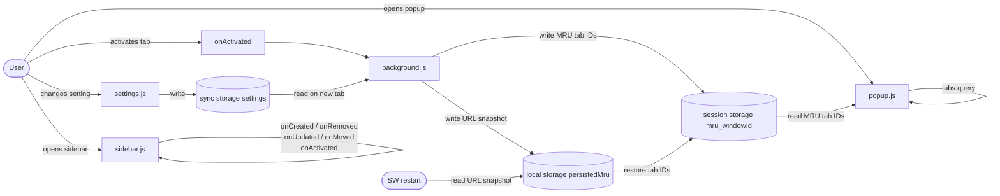

# Implementation Notes

## Architecture

## Drag and drop

### Tab dragging

- Tab rows are draggable. `dragState = { type: 'tab', tabId, sourceGroupId }`.
- Drop onto a tab row: `chrome.tabs.move()` to the target index, then `chrome.tabs.group()` if the target is inside a group, or `chrome.tabs.ungroup()` if the source was grouped and the target is not.
- Drop onto a group header: `chrome.tabs.group()` + `chrome.tabs.move()` to place the tab at the end of the group (group first, then query fresh positions to move, since `tabs.group()` places the tab unpredictably).
- Tabs cannot be dropped into the pinned section unless the dragged tab is itself pinned.
- Index adjustment: Chrome removes the dragged tab before inserting, so subtract 1 from the target index when the dragged tab's current index is lower than the target's.

### Group dragging

- Group headers are draggable. `dragState = { type: 'group', groupId }`.
- Drop uses `chrome.tabGroups.move()` to move the group atomically (using `chrome.tabs.move()` with an array of tab IDs breaks group membership).
- After moving, re-apply `collapsed: true` if the group was collapsed before the move — `tabGroups.move()` expands collapsed groups as a side effect.
- When dragging a group over another group's rows, the drop indicator snaps to the group's boundary rather than individual rows, preventing groups from being split.

### Drop indicator and reliability

- The drop indicator is positioned absolutely (no layout shift) over the boundary between rows.
- `lastDragTarget` is updated on every `dragover` and used by `drop`. This ensures drops in gaps between rows (where no row fires `dragover`) still land correctly via the `tabTree` fallback handler.
- Drop events on rows and headers call `e.stopPropagation()` to prevent the `tabTree` fallback handler from also firing and running the drop logic twice.
- `dragLocked = true` during a drag to suppress `loadTabs()` re-renders. Cleared in `dragend` after the drop promise resolves.
- Hovering over a collapsed group for 1s during a tab drag expands it. On expansion, `allGroups` is updated in memory and `render()` is called directly (bypassing `loadTabs()`).

### Split view tabs

- Tabs in a split view share a `splitViewId`. Non-split tabs have `splitViewId === chrome.tabs.SPLIT_VIEW_ID_NONE`.
- Split view tabs are non-draggable (`row.draggable = false`) because there is no API to move them together atomically.
- A bracket indicator (`::before` with CSS borders) is rendered on the left edge of split tab rows — a rounded corner cap at the midpoint of the first and last tab, connected by a vertical line.

## Tab updates

### Patch updates vs. full reload

- `chrome.tabs.onUpdated` fires for many properties. Structural changes (`groupId`, `splitViewId`, `pinned`) trigger a full `loadTabs()` re-render. Visual-only changes (`title`, `favIconUrl`, `audible`) go through `patchTab()` which mutates only the affected DOM nodes in place, avoiding unnecessary re-renders.
- `chrome.tabs.onActivated` is handled separately with a direct DOM class swap — no re-render needed.

## Context menu

- The sidebar is an extension page, so `chrome.contextMenus` (which targets content pages in the main tab) cannot add items to right-clicks within it.
- Instead, the default `contextmenu` event is suppressed on tab rows and a custom menu is rendered as a fixed-position `
`, styled to match macOS native menus (frosted glass background, inset item highlight, `cursor: default`).
