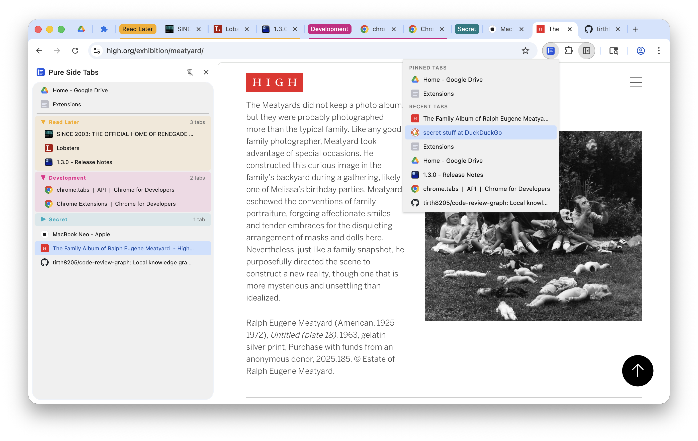

# Pure Side Tabs

A Chrome extension that lists your open tabs in a vertical sidebar.

**Zero dependencies.** No npm packages. No bundler. No external scripts or CDN resources. The code that runs is exactly the code you see in this repository.

**No data leaves your browser.** The extension makes no network requests. Your tab titles and URLs are displayed locally and never sent anywhere.

## Features

- Vertical list of all open tabs in the current window
- Tab groups shown with color-coded headers, matching Chrome's built-in group colors
- Collapse and expand tab groups by clicking the group header
- Click any tab to switch to it
- Close tabs with the × button
- Right-click any tab for a context menu: reload, duplicate, pin/unpin, mute/unmute, move to new window, remove from group, close, close other tabs, close all tabs below
- Speaker icon on tabs that are playing audio
- Visual bracket indicator for tabs open in split view
- Pinned tabs shown at the top, separated from regular tabs
- Toolbar popup showing pinned tabs and recently used tabs, with keyboard navigation (↑/↓ or j/k, Enter to switch)
- Press **/** in the popup to search all open tabs and recently closed tabs by title or URL, sorted by recency
- Keyboard shortcut **Ctrl+B** (Cmd+B on Mac) to show/hide the sidebar
- Keyboard shortcut **Ctrl+E** (Cmd+E on Mac) to activate the extension
- Drag and drop to reorder tabs and tab groups; drop a tab onto a group header to add it to the group
- Automatically updates as tabs open, close, move, pin, or change
- Respects your system light/dark mode preference

## Settings

Access settings via right-click on the extension icon → **Options**, or through `chrome://extensions` → PureSideTabs → **Details** → **Extension options**.

| Setting | Default | Description |
|---------|---------|-------------|
| Recent tabs to show in popup | 10 | How many recently used tabs appear in the toolbar popup |
| Open new tabs inside current group | Off | When enabled, pressing Ctrl+T while on a grouped tab opens the new tab at the end of that group instead of at the end of the window |
| Always keep tab groups at top | Off | When enabled, tab groups always appear directly after pinned tabs. New tabs opened before any group are automatically moved after all groups, and dragging a tab above the groups section is disallowed |
